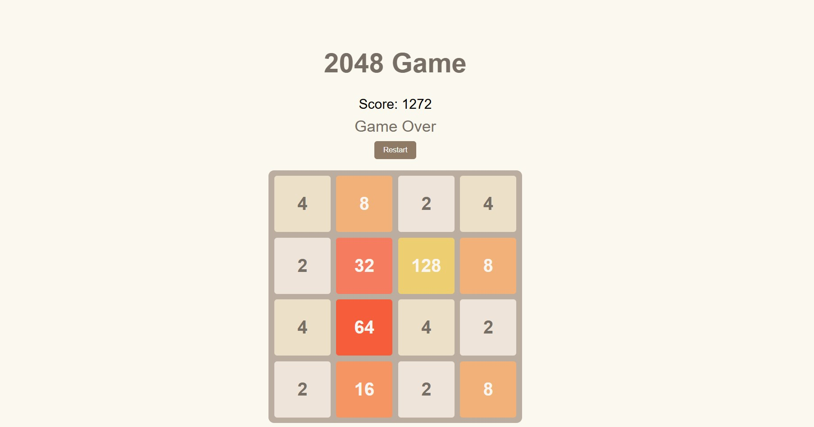

2048 React Game

A web-based implementation of the popular 2048 game built with React and Redux. Players combine tiles with the same number to reach 2048. The game features dynamic updates, score tracking, and a responsive graphical user interface.

Live Demo

Try it online: https://game-2048-react.netlify.app

Features

4x4 Board: Default board size with two initial tiles (2 or 4).

Tile Movement: Slide tiles up, down, left, right using keyboard arrows.

Tile Merging: Combine tiles with the same value to increase your score.

Score Tracking: Displays current score based on merged tiles.

Game Over & Win Conditions:

You Win! when a tile reaches 2048.

Game Over when no moves are possible.

Restart Game: Reset the board and score anytime.

Responsive & Animated Tiles: Smooth movement of tiles for a polished GUI.

Modular Code: Components, Redux state, and utilities are cleanly separaed.

Screenshots

Installation & Running Locally

Clone the repository

git clone https://github.com/Bhavesh-Prajapati8412/Game-2048.git

Navigate to the project directory

cd Game-2048

Install dependencies

npm install

Start the development server

npm start

Open http://localhost:3000
 to view it in the browser.

Build for Production
npm run build

This will create an optimized production build in the build folder, ready to deploy.

Technologies Used

Frontend: React, Redux Toolkit

State Management: Redux

Style
Deployment: Netlify

         
How It Works

Board Initialization: initBoard() generates a 4x4 board with 2 random tiles (2 or 4).

Tile Movement: Arrow keys trigger Redux actions that update the board using functions like moveLeft, moveRight, etc.

Tile Merging: Tiles with the same value merge, updating the score.

Random Tile Addition: After each move, a new tile (2 or 4) appears at a random empty spot.

Game Over Check: The game ends when the player reaches 2048 or no moves are possible.

Future Improvements

Configurable board size (e.g., 5x5, 6x6)

Undo/Redo moves feature

Mobile-friendly swipe gestures

Leaderboard & local storage for high scores

Smooth animations for merges and moves

Live Deployment

This project is deployed on Netlify: https://game-2048-react.netlify.app
